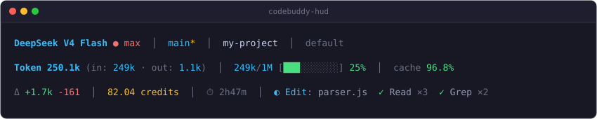

# CodeBuddy HUD

[](https://github.com/XisFool/codebuddy-hud/actions/workflows/ci.yml)
[](https://github.com/XisFool/codebuddy-hud/releases/latest)
[](https://nodejs.org/)
[](#安装)
[](LICENSE)

> 面向 **CodeBuddy Code** 的终端状态栏看板与插件（StatusLine HUD Plugin），带来类似 Claude Code `cc-hud` 的实时交互与监控体验。
>
> 会话每次交互后自动刷新，以严格 ≤3 行 ANSI 展示当前模型与推理强度、Git 分支状态、上下文 Token 用量、Prompt Cache 命中率、代码变更差异、实际会话消费（Credits）与工具活动调用频次。
>
> 纯 Node.js 内置模块实现（零 npm 依赖）；每次 push 均在 **macOS / Linux / Windows × Node 18/20/22** 矩阵上运行单元测试与安装验证。

[English](./README_en.md)

---

## 效果预览



```text
Deepseek-V4.1-Flash ● max  │  main*  │  my-project  │  default
Context Token 249k/1M [███░░░░░░░] 25%  │  out 1.1k  │  cache 96.8%
Δ +1.7k -161  │  82.04 credits  │  ⏱ 2h47m  │  ◐ Edit: parser.js  ✓ Read ×3  ✓ Grep ×2
```

### 布局说明

- **Line 1（身份）**：模型名称、推理强度（如 `● max`）、Git 分支（`*` 表示有未提交改动）、工作区目录名、当前权限模式。
- **Line 2（资源）**：当前上下文输入占用、窗口进度条与百分比（分子口径与宿主 `used_percentage` 一致）、输出 Token 与 Prompt Cache 本轮命中率；压缩后宿主尚未提供新 usage 时显示 `--` 和等待提示。
- **Line 3（本轮活动）**：代码变更行数 `Δ +N -M`（ASCII 终端降级为 `[D]`）、会话实际消费（credits；不可得时回退 `$USD`）、会话耗时、AI 当前动作、本轮已完成工具调用频次（最多 3 项）。

3 行为硬上限，对齐宿主 CodeBuddy Code（v2.146.0 实测按 stdout 前 3 行截断）；无数据的行或字段整体隐藏，不会输出多余空行。

---

## 安装

要求：Node.js >= 18（安装脚本会先校验）。在普通终端中执行一条命令，无需克隆仓库或配置环境。

**Windows（PowerShell）**

```powershell
irm https://raw.githubusercontent.com/XisFool/codebuddy-hud/master/scripts/install.ps1 | iex
```

**Windows（CMD）**

```cmd
powershell -ExecutionPolicy Bypass -Command "irm https://raw.githubusercontent.com/XisFool/codebuddy-hud/master/scripts/install.ps1 | iex"
```

**macOS / Linux（Bash）**

```bash
curl -fsSL https://raw.githubusercontent.com/XisFool/codebuddy-hud/master/scripts/install.sh | bash
```

> **为什么不是一条 插件安装 命令？** 插件清单（`.codebuddy-plugin/plugin.json`）只声明元数据，不会下载运行时，也不会写入 `settings.json` 的 `statusLine`（宿主清单 schema 无 statusLine 字段）。安装脚本负责这两件事：把 runtime 落到 `~/.codebuddy/codebuddy-hud-runtime/runtime/`，再写入 `statusLine.command`。

安装器行为：

1. 通过 302 重定向（无 API 限流）或 REST API（支持 `GITHUB_TOKEN` 认证）查询最新 Release 的 `tag_name`，将安装固定到该 release（不使用可变分支）。所有下载自动重试 3 次。
2. 下载 runtime 至 `~/.codebuddy/codebuddy-hud-runtime/`。
3. 备份并写入 `~/.codebuddy/settings.json` 的 `statusLine.command`；Windows 同时生成 `.cmd` shim，烘焙 Node 绝对路径，不依赖系统 PATH。

**幂等**：重复运行同一条命令即可修复、升级或清理旧版本残留。

**触发方式**：安装后重启 CodeBuddy Code，并发送任意一条消息。宿主在会话事件后约 300ms 去抖触发刷新；空闲会话不绘制状态栏，因此刚进入会话时底部为空属正常现象。

内置每 24 小时一次的后台版本检查，发现新版本时提示重新运行安装命令升级。

### 🇨🇳 国内镜像加速安装

如果直连 GitHub 超时或网络不稳定，设置 `CODEBUDDY_HUD_MIRROR` 即可一键走镜像（安装脚本和 bootstrap.js 均自动使用该前缀）：

**Windows（PowerShell）**

```powershell
$env:CODEBUDDY_HUD_MIRROR='https://ghfast.top'; irm "https://ghfast.top/https://raw.githubusercontent.com/XisFool/codebuddy-hud/master/scripts/install.ps1" | iex
```

**macOS / Linux（Bash）**

```bash
export CODEBUDDY_HUD_MIRROR=https://ghfast.top
curl -fsSL "https://ghfast.top/https://raw.githubusercontent.com/XisFool/codebuddy-hud/master/scripts/install.sh" | bash
```

> 可替换 `ghfast.top` 为其他 GitHub 加速镜像（如 `ghproxy.net`、`gh-proxy.com`），格式均为 `https://镜像域名/原始GitHub URL`。

### Git Clone 本地安装（零网络风险）

```bash
git clone https://github.com/XisFool/codebuddy-hud.git  # 或 git clone https://ghfast.top/https://github.com/XisFool/codebuddy-hud.git
cd codebuddy-hud
node scripts/bootstrap.js
```

本地安装模式直接从仓库复制文件，全程无远程 HTTP 请求。

### Fork / 镜像安装（高级）

**macOS / Linux**：

```bash
export CODEBUDDY_HUD_BOOTSTRAP_URL=https://your-mirror/scripts/bootstrap.js
export CODEBUDDY_HUD_RAW_BASE=https://your-mirror/codebuddy-hud/v0.2.1
curl -fsSL https://your-mirror/scripts/install.sh | bash
```

**Windows（PowerShell）**：

```powershell
$env:CODEBUDDY_HUD_BOOTSTRAP_URL = 'https://your-mirror/scripts/bootstrap.js'
$env:CODEBUDDY_HUD_RAW_BASE = 'https://your-mirror/codebuddy-hud/v0.2.1'
irm https://your-mirror/scripts/install.ps1 | iex
```

说明：

- `CODEBUDDY_HUD_MIRROR` — 最简方式，只需设置镜像域名（如 `https://ghfast.top`），安装脚本和 bootstrap.js 自动为所有 GitHub URL 添加该前缀；
- `CODEBUDDY_HUD_BOOTSTRAP_URL` — 供安装脚本下载 bootstrap.js 使用，必须指向镜像上的 `scripts/bootstrap.js` 本体，不是镜像根目录；
- `CODEBUDDY_HUD_RAW_BASE` — 供 bootstrap.js 拉取 runtime 文件使用；**一旦设置会跳过 GitHub Latest Release 查询**，示例锁定 tag 路径（`vX.Y.Z`）以维持"安装固定到 release、不使用可变分支"的既有承诺（安装器行为第 1 条）；
- `GITHUB_TOKEN` / `GH_TOKEN` — 可选，设置后 GitHub API 请求携带认证，rate limit 从 60/h 提升至 5000/h；
- bash 下环境变量必须导出（作用于 `bash` 进程），不能只前缀给 `curl`。

---

## 安装验证

```bash
# 1. settings.json 中应存在指向 runtime 的 statusLine.command
grep -A2 '"statusLine"' ~/.codebuddy/settings.json

# 2. 直接运行入口，应以演示数据渲染 3 行看板后退出
node ~/.codebuddy/codebuddy-hud-runtime/runtime/bin/codebuddy-hud.js --status
```

Windows PowerShell：

```powershell
Get-Content "$env:USERPROFILE\.codebuddy\settings.json"
& "$env:USERPROFILE\.codebuddy\codebuddy-hud-runtime\runtime\bin\codebuddy-hud.cmd" --status
```

> 下文以 `codebuddy-hud` 简记入口：一键安装即上述 `...codebuddy-hud.js`（Windows 为 `.cmd`）；源码安装并执行 `npm link` 后可直接使用 `codebuddy-hud`。

以下现象属正常降级，不是安装失败：

- 会话空闲时底部为空 —— 宿主仅在会话事件后刷新，发送一条消息即出现。
- `cache --` 或 Credits 缺失 —— 当前供应商未返回对应遥测字段，HUD 按三态契约降级展示，不伪造数据。

---

## 诊断

```bash
codebuddy-hud --doctor   # 体检 Node 环境、settings.json 与 statusLine 指向、终端编码、Git、transcript 访问
```

常见问题与处理：

| 现象 | 处理 |
| :--- | :--- |
| 底部始终无 HUD | 先发送任意消息触发刷新；仍无则运行 `--doctor` 检查配置指向 |
| 乱码 / 方块符号 | 运行 `chcp 65001` 切换 UTF-8；仍不兼容时设 `CODEBUDDY_HUD_FORCE_ASCII=1` 使用纯 ASCII 符号，或设 `CODEBUDDY_HUD_FORCE_UNICODE=1` 强制 Unicode |
| `cache --` / 无消费数据 | 遥测字段不可得时的正常降级，见「安装验证」 |
| `/clear` 后 Δ / 耗时表现 | 宿主会切换新 transcript，HUD 自动重建基线并重置 Δ / 耗时，发送下一条消息后生效 |
| 需要排查底层错误 | 查看 `~/.codebuddy/codebuddy-hud-error.log`（超过 1MB 自动轮转） |

---

## 卸载

```bash
codebuddy-hud --uninstall
```

卸载程序会：

1. 优先从安装时保留的原始备份还原 `settings.json`；无备份时仅移除 `statusLine` 项。
2. 删除 Windows `.cmd` shim。
3. 清理 HUD 自身的缓存与状态文件（编码缓存、Git 缓存、使用量 checkpoint、会话统计、credit 状态、更新状态）。

用户主题配置（`codebuddy-hud.config.json`）与已安装的 `~/.codebuddy/codebuddy-hud-runtime/` 运行时目录会被保留（可按需手动删除）；除 `statusLine` 外，不会改动 `settings.json` 中的任何其他配置项。

---

## 主题

内置 5 套主题，每套均提供深色 / 浅色两种配色：

| 主题 | 说明 |
| :--- | :--- |
| `ocean`（默认） | 深海青蓝 |
| `emerald` | 翡翠绿 |
| `cyberpunk` | 赛博朋克（粉紫 + 荧光青） |
| `amber` | 琥珀金 |
| `monochrome` | 黑白极简 |

```bash
codebuddy-hud --theme           # 交互式选择：↑/↓ 实时预览，1-5 数字快选，Enter 确认，Esc 取消
codebuddy-hud --theme cyberpunk # 直接指定
codebuddy-hud --theme list      # 仅列出全部主题
```

也可以直接在 CodeBuddy Code 会话中描述需求（内置 `hud-config` Skill 会自动触发并写入配置），例如：“把 HUD 主题换成 cyberpunk”。

`themeMode` 默认 `auto`，结合终端背景信号（如 `COLORFGBG`）自动切换深 / 浅配色，也可强制 `dark` 或 `light`。

---

## 配置

可选的。在项目根目录创建 `codebuddy-hud.config.json` 仅对当前项目生效；在 `~/.codebuddy/` 创建同名文件对所有项目生效。优先级：项目 > 用户 > 内置默认。

```json
{
  "theme": "ocean",
  "themeMode": "auto",
  "language": "zh",
  "display": {
    "showTokenBar": true,
    "showCacheHitRate": true,
    "showDiffStats": true,
    "showCost": true,
    "showToolActivity": true,
    "useNerdFonts": false,
    "unicode": "auto"
  }
}
```

字段说明：

- `theme` / `themeMode`：主题与深浅色模式，见「主题」。
- `language`：界面语言 `zh` / `en`（默认 `en`；设为其他值时按系统 locale 自动判定）。
- `defaultEffortLevel`：未捕获到推理强度时的回退档位（默认 `medium`）。
- `display.*`：各行片段开关，均默认 `true`，另有 `showDuration` / `showGitBranch` / `showCurrentDir` / `showPermissionMode` 等；`useNerdFonts`（默认 `false`）启用 Nerd Fonts 图标；`unicode` 取值 `auto` / `true` / `false`（默认 `auto`，按终端能力探测）。
- `thresholds`：上下文进度条的警告 / 危险阈值（默认 `0.7` / `0.9`）。
- `cacheHitThresholds`：缓存命中率的配色分级阈值（默认 `80` / `50`）。

---

## 命令行参考

| 命令 | 说明 |
| :--- | :--- |
| `--setup` | 将 `statusLine` 写入 `settings.json`（源码本地安装时使用） |
| `--status` | 以演示数据渲染一次看板并退出 |
| `--theme [name\|list]` | 交互式主题选择器；`list` 列出主题；带名称时直接切换 |
| `--doctor` / `-d` | 输出环境诊断报告 |
| `--uninstall` | 卸载并从备份还原配置 |

---

## 文件结构

```text
codebuddy-hud/
├── runtime/
│   ├── bin/codebuddy-hud.js      # 入口：stdin payload → ANSI 看板；承载全部 CLI 子命令
│   ├── renderer.js / renderer/   # 3 行布局组装与分段渲染（format / diff-render / agents-render）
│   ├── parser.js                 # payload 解析（token / diff / cost）
│   ├── transcript.js             # 尾读 transcript：本轮工具频次与 usage 聚合
│   ├── session-stats.js          # /clear 会话重置识别与基线交接
│   ├── config.js                 # 主题预设、深浅色解析与 deepMerge
│   ├── theme-selector.js / lang.js          # 交互式换肤与 i18n 字典
│   ├── doctor.js / statusline-installer.js  # 环境诊断 / 写入宿主配置
│   ├── uninstall.js / settings-file.js      # 卸载清理 / JSONC 安全写入
│   ├── update-checker.js         # 后台版本检查（24h 间隔）
│   ├── encoding.js / git.js / model-info.js / paths.js / sanitize.js
│   └── codebuddy-hud.config.json # 内置默认配置与主题预设
├── scripts/                      # install.sh / install.ps1 / bootstrap.js / verify-*.js / run-tests.js
├── tests/                        # node --test 单元测试与 payload fixtures
├── docs/                         # 架构与模块深度参考
└── skills/hud-config/            # CodeBuddy 配置 Skill（会话内触发）
```

---

## 跨平台说明

- **Windows**：安装时生成 `codebuddy-hud.cmd` shim，烘焙 Node 绝对路径；检测到非 ASCII 路径时自动注入 `@chcp 65001`。终端编码探测结果会被缓存，`CODEBUDDY_HUD_FORCE_ASCII` / `CODEBUDDY_HUD_FORCE_UNICODE` 始终优先于缓存。
- **Windows 路径限制**：宿主 v2.146.0 启动链对含空格、引号等特殊字符的路径存在转义限制，请避免将仓库或运行时放在此类目录中。
- **ASCII 降级**：终端不支持 Unicode 时自动切换为纯 ASCII 符号（边框、进度条、图标），功能不受影响。
- **macOS / Linux**：直接以 `node` 调用入口，无需 shim。

---

## CI 验证

每次 push 运行 3 OS × Node 18/20/22 矩阵（见顶部 CI 徽章）：

- `npm test` —— 单元测试：解析、渲染、会话状态、配置与安装等全量模块。
- `npm run verify` —— E2E：payload 渲染、CLI 命令形态与边界场景。
- `node scripts/verify-install.js` —— 隔离宿主下的真实安装 / 卸载流程。

---

## 开发

```bash
git clone https://github.com/XisFool/codebuddy-hud.git
cd codebuddy-hud

node runtime/bin/codebuddy-hud.js --setup   # 注册到本机 CodeBuddy
npm link                                    # 可选：全局 codebuddy-hud 命令

npm test && npm run verify && npm run verify:install   # 全量验证
```

参考文档：

- [AGENTS.md](AGENTS.md) — 开发硬约束、避坑指南与提交验证闭环。
- [docs/architecture_zh.md](docs/architecture_zh.md) — 系统架构与数据流（英文版：[architecture.md](docs/architecture.md)）。
- [docs/module-reference.md](docs/module-reference.md) — 模块接口与落盘状态参考。
- [CHANGELOG.md](CHANGELOG.md) — 版本变更记录。

---

## 许可证

本项目基于 [MIT License](LICENSE) 开源发布。
