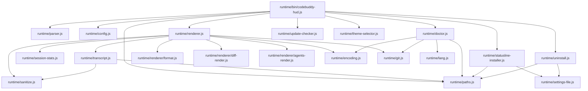
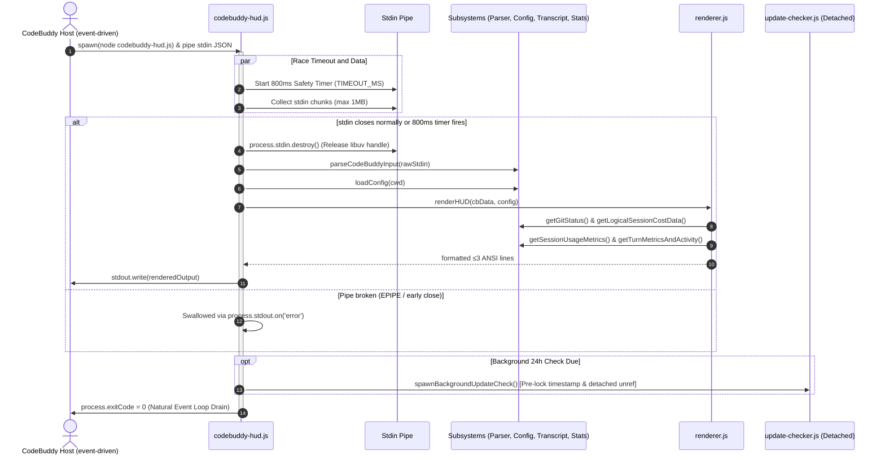

# CodeBuddy HUD System Architecture

> **Target Version:** `v0.2.0+`  
> **Host Compatibility:** CodeBuddy Code CLI; v2.146.0 has the Windows quoting and three-line display limits described below.
> **Engine Baseline:** Pure Node.js Standard Library (`>= 18.0.0`, Zero npm dependencies)

---

## 1. Overview & Core Philosophy

`codebuddy-hud` is a high-performance terminal statusline HUD plugin designed for the **CodeBuddy Code** AI pair-programming assistant. It renders real-time, compact telemetry dashboards directly into the terminal window during active coding sessions.

### Core Architectural Invariants:
1. **Zero External Dependencies**: Implemented strictly using Node.js built-in standard libraries (`fs`, `path`, `os`, `crypto`, `child_process`, `readline`, `https`). No `node_modules` installation is required.
2. **Statusline Host Contract**:
   - **Execution Budget**: $\le 1500\text{ms}$ total, with an internal stdin read timeout of $800\text{ms}$. Timers cannot preempt synchronous filesystem calls or JSON parsing.
   - **Constant Zero Exit Code**: The process must **always** terminate with `process.exitCode = 0`. Uncaught runtime exceptions are redirected to `~/.codebuddy/codebuddy-hud-error.log` (capped at 1MB with auto-rotation) to prevent host terminal disruption.
   - **Output Height Boundary**: Strictly $\le 4$ ANSI-formatted terminal lines. Unused or empty lines are dynamically pruned.
3. **Truthful & Non-Fabricated Telemetry**: Prompt Cache hit percentages and cumulative Credit expenditures are extracted directly from authentic session `transcript.jsonl` records, gracefully degrading to `cache --` when telemetry is absent.

---

## 2. Two-Layer Physical Design

`codebuddy-hud` separates plugin metadata from the runtime execution engine:

```
┌──────────────────────────────────────────────────────────────────────────┐
│  PLUGIN LAYER  (Discovered by CodeBuddy / Agent, root & skills/)        │
│   .codebuddy-plugin/plugin.json · skills/hud-config/SKILL.md            │
└────────────────────────────────────┬─────────────────────────────────────┘
                                     │  bootstrap.js installs & atomizes
┌────────────────────────────────────▼─────────────────────────────────────┐
│  RUNTIME LAYER  (~/.codebuddy/codebuddy-hud-runtime/ or repo checkout)  │
│   runtime/bin/codebuddy-hud.js    ← Registered as statusLine.command     │
│   runtime/bin/codebuddy-hud.cmd   ← Windows portable shim wrapper        │
│   parser.js · config.js · paths.js · encoding.js · git.js · sanitize.js │
│   doctor.js · update-checker.js · session-stats.js · uninstall.js       │
│   transcript.js (Reverse sliding-window & SHA-256 telemetry scanner)     │
│   renderer.js (4-Line orchestration) ──> renderer/ (format, diff, agents)│
└──────────────────────────────────────────────────────────────────────────┘
```

- **Plugin Layer**: Staged in `.codebuddy-plugin/` and `skills/`. Declares metadata, command entries (`status`, `setup`, `uninstall`, `theme`, `doctor`), and AI Agent configuration capabilities.
- **Runtime Layer**: Deployed locally or via `scripts/bootstrap.js`. Contains all business logic, rendering subsystems, caching state machines, and platform shims.

---

## 3. Module Dependency Graph



---

## 4. Execution Flow per Agent Step

CodeBuddy Code v2.146.0 triggers HUD on session, result, settings and related events, with approximately 300ms debounce. Idle sessions do not refresh periodically. Failed commands clear the displayed HUD and do not schedule automatic retries.



---

## 5. Core Subsystems & Deep Mechanics

### 5.1 Reverse Sliding-Window Transcript Scanning (`transcript.js`)
- **Problem**: Comprehensive telemetry (Prompt Cache hits, exact credit billing, tool names) is only recorded in the host's `transcript.jsonl`. However, transcript files can exceed hundreds of megabytes during long coding sessions.
- **Scanning Algorithm**:
  1. **Tail Seeking**: `getTurnMetricsAndActivity()` shares one reverse scan for turn usage and tool activity. It reads from `EOF` in 16KB chunks by default (`tailBytes: 16384`), capped at a 256KB total scan window. Session Credits use a separate forward checkpoint scan.
  2. **Straddle Line Reconstruction**: When a sliding chunk boundary cuts across a JSON line, the trailing fragment is buffered and prepended to the preceding chunk to assemble valid JSON.
  3. **Turn Boundary Termination**: The scanner traverses backwards, aggregating API usage blocks until it encounters an entry with `role: 'user'`. This guarantees metrics reflect the **current turn aggregation**, not isolated burst steps.
  4. **Field Priority Resolution**:
     ```
     With valid rawUsage.prompt_tokens:
       prompt_cache_hit_tokens -> prompt_tokens_details.cached_tokens -> cached_tokens -> 0
     Otherwise, with valid usage.inputTokens:
       sum(usage.inputTokensDetails[].cached_tokens)
     ```

### 5.2 Session Baseline Tracking & `/clear` Detection (`session-stats.js`)
- **Problem**: When a user executes `/clear`, the host context window resets, but cumulative tokens or added lines in the raw payload may report non-monotonic drops or retain stale session history.
- **State Machine**:
  1. Persists logical session baselines in `~/.codebuddy/codebuddy-hud-session-state/<hash>.json`.
  2. Detects a clear boundary if:
     - Current `input_tokens` drops to $\le 2048$ while previous current input was $\ge 8192$, or cumulative `total_input_tokens` decreases;
     - Current `session_id` changes for the same transcript path;
     - Lines added/removed or duration counters drop below their stored baselines (the cost baseline then resets to zero).
  3. Subtracts the established baseline from raw host stats to display accurate turn-relative diffs and elapsed durations.

### 5.3 Incremental SHA-256 Checkpointing for Credits (`transcript.js`)
- **Problem**: Recomputing full-session credits on every event repeats parsing of existing records, especially in long transcripts.
- **Checkpoint Algorithm**:
  1. Hashes the transcript absolute path with SHA-256 to isolate state: `~/.codebuddy/codebuddy-hud-usage-state/<sha256>.json`.
  2. Stores checkpoint state (version 5): `{ version, path, identity: { dev, ino, birthtimeMs }, headHash, offset, credits, creditCallCount, checkpointHash, sourceSize, sourceMtimeNs, sourceCtimeNs, sourceContentHash, updatedAt }`.
  3. Parses appended records from `offset`, retaining small identity/checkpoint verification reads. The chunk loop has a 100ms budget; an incomplete scan saves its progress and returns `complete: false` with no exposed credits total. The renderer hides Credits instead of falling back to payload credits. A partial trailing JSONL record remains uncommitted until complete.
  4. **Rewrite & Truncation Guard**: If current `file.size < state.offset`, the state machine detects in-place rewrite or truncation, resets `offset = 0`, and seamlessly rebuilds the checkpoint.

### 5.4 Background Update Stampede Prevention (`update-checker.js`)
- **Repeated Launches**: Event bursts can start another HUD while an update request is pending. Writing `lastCheck` before spawn throttles subsequent invocations; it is not a cross-process mutex.
- **Timestamp Reservation**:
  ```javascript
  // Persist placeholder lock before spawning to block concurrent triggers
  writeUpdateStatus({
    ...(currentStatus || {}),
    lastCheck: Date.now(), // PRE-LOCK
  });
  const child = spawn(process.execPath, [scriptPath, '--run-check'], {
    detached: true,
    stdio: 'ignore',
    windowsHide: true,
  });
  child.unref();
  ```
  Network failures preserve the last valid update result and refresh `lastCheck`. The request has an 8s timer; the detached CLI checker also has a 15s exit fallback.

### 5.5 Multi-Layer Configuration & Theme Engine (`config.js`)
- **Precedence Hierarchy** (5 layers, merged via `deepMerge` in `loadConfig`):
  ```
  Defaults (Built-in DEFAULT_CONFIG)
    → Bundled Config (runtime/codebuddy-hud.config.json)
      → Global User Config (~/.codebuddy/codebuddy-hud.config.json)
        → Project Local Config (<cwd>/codebuddy-hud.config.json)
          → Theme Resolution (resolveTheme based on merged config)
  ```
  Note: `--theme <name>` is a persistent write operation (saves to user config), not a runtime argument overlay.
- **Security Guard**: `deepMerge()` skips `__proto__` and caps recursion at 64. Config files are read directly on each load; the settings effort fallback keeps only a process-local cache, while the transcript effort signal is persisted per transcript hash under the session-state directory (`effort-<sha256>.json`), supporting tail-scan adjudication, cache inheritance, and a bounded cold-start head scan.

### 5.6 3-Line Adaptive Layout & Pruning (`renderer.js`)
- **Line 1 (Identity & Status)**: Model Display Name · Reasoning Effort Icon · Git Branch & Dirty (`*`) · Workspace Name · Permission Mode · Version Badge.
- **Line 2 (Tokens & Context)**: Total Tokens (In/Out breakdown) · Progress Bar (`[███░░░░░░░]`) · Percentage Used · Turn Cache Hit Badge.
- **Line 3 (Diff & Cost & Latency & Tool Activity)**: `Δ +Added -Removed` · Actual Credits · Total Duration · Current tool activity and turn-aggregated tool badges (`◐ Edit: parser.js`, `✓ Edit ×3`). (Omitted if all are zero).

CodeBuddy Code v2.146.0 retains only the first three stdout lines. The HUD's own three-line contract is strictly aligned with this truncation limit; tool activity is merged into Line 3 so every key segment stays visible.

---

## 6. Security Threat Model & Terminal Defense

`codebuddy-hud` implements defensive sanitization on **every** dynamic string before output:

| Threat Vector | Attack Payload Example | Defense Mechanism (`runtime/sanitize.js`) |
| :--- | :--- | :--- |
| **ANSI CSI Escape Injection** | `\x1b[2J\x1b[H` (Clear screen exploit) | Strips all CSI sequences matching `/\x1b\[[0-?]*[ -/]*[@-~]/g`. |
| **OSC Escape Payloads** | `\x1b]52;c;...\x07` (Clipboard hijack) | Strips all OSC sequences matching `/\x1b\][^\x07]*?(?:\x07|\x1b\\|$)/g`. |
| **Bidi Text Disguise** | `\u202E` (Right-to-Left Override) | Removes bidirectional Trojan characters (`U+202A` through `U+202E`, `U+2066`-`U+2069`). |
| **Terminal Control Chars** | `\x00-\x08`, `\x0B-\x1F`, `\x7F` | Strips ASCII C0/C1 control codes and NUL bytes. |
| **Oversized String Floods** | 50,000 char git branch name | Hard length truncation to safe viewport boundaries (e.g. 64/128 chars). |

---

## 7. System Failure Modes & Degradation Matrix

| Failure Event | Root Cause | System Degradation Behavior | Exit Code |
| :--- | :--- | :--- | :---: |
| **Empty Stdin** | Early hook trigger / absent payload | Handles empty input without inventing telemetry. | `0` |
| **Stdin Hang** | Host pipe remains open without sending EOF | $800\text{ms}$ timeout timer fires, forcibly closes stdin and renders collected input. | `0` |
| **EPIPE Error** | Host kills statusline process while stdout writing | `process.stdout.on('error', () => {})` swallows error cleanly. | `0` |
| **Missing Transcript** | First turn / remote headless session | Omits tool activity and falls back to payload-supplied token counts. | `0` |
| **Corrupt JSONL / State** | Process killed mid-write | Checkpoint discarded; resets byte offset to 0 and rebuilds from start. | `0` |
| **Readonly Filesystem** | Permission restricted container | State writes fail silently; incomplete Credits scans remain hidden and may restart on later invocations. | `0` |
| **Git Timeout** | Huge mono-repo / NFS lag | Falls back to a directly readable branch with `dirty: null`, otherwise omits it. | `0` |
| **Network Failure** | Offline / DNS failure in update check | Preserves existing update status, updates `lastCheck` timestamp, and exits silently. | `0` |

---

## 8. Cross-Platform & Zero-Dependency Guarantees

1. **Windows `.cmd` Shim Path Baking**:
   - `statusline-installer.js` bakes the exact `process.execPath` into `codebuddy-hud.cmd` during `--setup`.
   - Batch percent characters (`%`) in paths are automatically escaped as `%%` to avoid `cmd.exe` variable substitution corruption.
   - The shim is UTF-8, with `chcp 65001` when needed; UTF-16LE batch files are not supported by the tested cmd.exe invocation.
   - v2.146.0 containment double-escapes literal quotes. Safe ASCII shim paths are left unquoted; paths requiring quotes retain them and remain subject to the host limitation.
2. **Terminal UTF-8 Auto-Detection**:
   - On Windows, queries `chcp.com` and caches the result (`65001`) in `codebuddy-hud-cache-state.json`.
   - Seamlessly falls back to ASCII glyphs (`#`, `-`, `|`, `[A]`, `[Q]`, `[D]`) when UTF-8 / Unicode is unsupported.
3. **Natural Event Loop Drain**:
   - Eliminates abrupt `process.exit()` in rendering path. Releases all active `stdin` handles, timer handles, and let libuv naturally exit to prevent stdout buffer truncation.
4. **Settings Writes**:
   - JSONC parsing preserves string content. Atomic replacement follows valid symlinks and retains existing POSIX permissions and ownership; new settings and first backups default to `0600`. Multiple hard links are rejected rather than silently detached.
   - Uninstall restores only `statusLine`, preserves other settings and user themes, and retains the backup if writing fails.
5. **Verification Isolation**:
   - Setup/uninstall tests isolate runtime, settings and user state together. `CODEBUDDY_HOME` alone cannot protect the checkout's generated shim.
