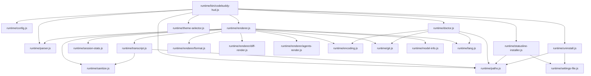
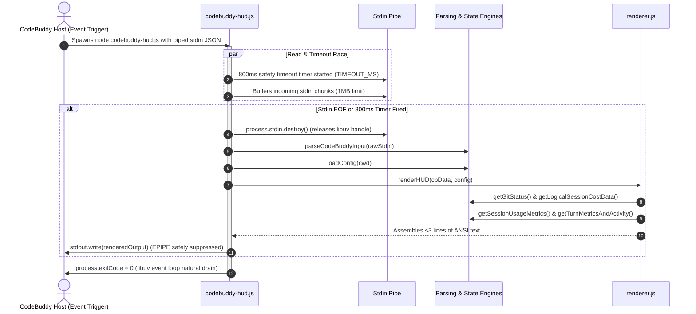

# CodeBuddy HUD System Architecture

> **Target Version:** `v0.3.7+`  
> **Host Compatibility:** CodeBuddy Code CLI; v2.146.0 has the Windows quoting and three-line display limits described below.
> **Engine Baseline:** Pure Node.js Standard Library (`>= 18.0.0`, Zero npm dependencies)

---

## 1. Overview & Core Philosophy

`codebuddy-hud` is a high-performance terminal statusline HUD plugin designed for the **CodeBuddy Code** AI pair-programming assistant. It renders real-time, compact telemetry dashboards directly into the terminal window during active coding sessions.

### Core Architectural Invariants:
1. **Zero External Dependencies**: Implemented strictly using Node.js built-in standard libraries (`fs`, `path`, `os`, `crypto`, `child_process`, `readline`, `https`, `http`). No `node_modules` installation is required.
2. **Statusline Host Contract**:
   - **Execution Budget**: $\le 1500\text{ms}$ total, with an internal stdin read timeout of $800\text{ms}$. Timers cannot preempt synchronous filesystem calls or JSON parsing.
   - **Constant Zero Exit Code**: The process must **always** terminate with `process.exitCode = 0`. Uncaught runtime exceptions are redirected to `~/.codebuddy/codebuddy-hud-error.log` (capped at 1MB with auto-rotation) to prevent host terminal disruption.
   - **Output Height Boundary**: Strictly $\le 3$ ANSI-formatted terminal lines, aligned with the host's 3-line truncation limit. Unused or empty lines are dynamically pruned.
3. **Truthful & Non-Fabricated Telemetry**: Prompt Cache hit percentages and cumulative Credit expenditures are extracted directly from authentic session `transcript.jsonl` records, gracefully degrading to `cache --` when telemetry is absent.

---

## 2. Two-Layer Physical Design

`codebuddy-hud` separates plugin metadata from the runtime execution engine:

```
┌──────────────────────────────────────────────────────────────────────────┐
│  PLUGIN LAYER  CodeBuddy / Agent Discovery Entrypoint (root & skills/)    │
│   .codebuddy-plugin/plugin.json · skills/hud-config/SKILL.md             │
└────────────────────────────────────┬─────────────────────────────────────┘
                                     │  bootstrap.js atomic install & overwrite
┌────────────────────────────────────▼─────────────────────────────────────┐
│  RUNTIME LAYER  ~/.codebuddy/codebuddy-hud-runtime/ or local source      │
│   runtime/bin/codebuddy-hud.js    ← registered to settings.json statusLine│
│   runtime/bin/codebuddy-hud.cmd   ← Windows absolute-path node shim       │
│   parser.js · config.js · paths.js · encoding.js · git.js · sanitize.js  │
│   lang.js · model-info.js · settings-file.js · statusline-installer.js   │
│   theme-selector.js · doctor.js · session-stats.js                       │
│   transcript.js (sliding-window telemetry & SHA-256 checkpoint) · uninstall│
│   renderer.js (3-line layout engine) ──> renderer/ (format, diff, agents) │
└──────────────────────────────────────────────────────────────────────────┘
```

- **Plugin Layer**: Defines `.codebuddy-plugin/` metadata and `skills/hud-config/` capabilities for automated AI Agent configuration.
- **Runtime Layer**: Implements full telemetry parsing, rendering, state management, and platform shims.

---

## 3. Module Dependency Topology

> **Note**: This diagram illustrates the primary end-to-end execution flows. Full intra-module require dependencies across all utility modules are detailed in [docs/module-reference.md](module-reference.md).



---

## 4. Execution Lifecycle & Timing

The host (v2.146.0) debounces statusline invocations by ~300ms following turn events. Idle sessions do not poll; failed executions clear the statusline without automatic retry.



---

## 5. Core Subsystems & Algorithms

### 5.1 Sliding-Window Telemetry Scanner (`transcript.js`)
- **Problem**: Prompt Cache hits, actual Credits, and active tools exist exclusively within `transcript.jsonl`, which can grow to dozens of megabytes in long sessions.
- **Algorithm**:
  1. **Tail-Only Reverse Scan**: `getTurnMetricsAndActivity()` aggregates turn usage and tool events in a single backward pass (16KB default window, 256KB upper bound; 40-line general budget, 200-line turn budget). Cumulative Credits uses forward checkpoint scanning.
  2. **Straddle Reconstruction**: Slices spanning window boundaries are reassembled across sequential chunk reads.
  3. **Turn Boundary Truncation**: Scanning halts when encountering the latest `role: 'user'`, isolating telemetry strictly to the **current conversational turn**.
  4. **Priority Resolution**:
     ```
     With valid rawUsage.prompt_tokens:
       prompt_cache_hit_tokens -> prompt_tokens_details.cached_tokens -> cached_tokens -> 0
     Otherwise, with valid usage.inputTokens:
       sum(usage.inputTokensDetails[].cached_tokens)
     ```
  5. **Context Freshness & Dual Telemetry Matching (`contextStatus`)**:
     - **Parent-Chain Traversal (`createContextTracker`)**: Traces backwards along `parentId` links. A completed compact summary marks status `stale`.
     - **Dual Telemetry Matching (`resolveReportedInputs`)**: For providers (e.g. DeepSeek) where miss is treated as creation and host `input_tokens` is deducted down to 0, matches against either the reconstructed total (`input + cacheRead + cacheCreation`) or raw `input_tokens`. A match resolves to `fresh`.
     - **Fallback Tail Window (`getCompactContextStatus`)**: Compares append ordering within bounded tail chunks when boundary parent links are omitted by the host.

### 5.2 Session Baseline Tracking & `/clear` Detection (`session-stats.js`)
- **Problem**: When a user executes `/clear`, the host context window resets, but cumulative tokens or added lines in the raw payload may report non-monotonic drops or retain stale session history.
- **State Machine**:
  1. Persists logical session baselines in `~/.codebuddy/codebuddy-hud-session-state/<hash>.json`.
  2. Detects a clear boundary when any of the following holds:
     - **Cliff drop**: current `input_tokens` drops ≥50% relatively and ≥3000 absolutely;
     - **Return to initial**: current input $\le 4096$ with previous $\ge 6000$ (a ≥35% drop);
     - Cumulative `total_input_tokens` decreases;
     - A new `session_id` for the same transcript, a physically truncated transcript (file size shrinks), or an explicit host `clear_signal` / `is_clear`;
     - Lines added/removed or duration counters drop below their stored baselines (the cost baseline then resets to zero).
  3. Subtracts the established baseline from raw host stats to display accurate turn-relative diffs and elapsed durations.
  4. **Cross-file handoff**: when `/clear` swaps in a new transcript and the identity misses, the cwd-scoped `handoff-<sha256(cwd)>.json` is read; if the cumulative cost sequence has not regressed (same host process), it is inherited as the new baseline with Δ/duration reset to zero (protected by 5-minute TTL, cross-platform path normalization, and cost non-regression checks).

### 5.3 Incremental SHA-256 Checkpointing for Credits (`transcript.js`)
- **Problem**: Recomputing full-session credits on every event repeats parsing of existing records, especially in long transcripts.
- **Checkpoint Algorithm**:
  1. Hashes the transcript absolute path with SHA-256 to isolate state: `~/.codebuddy/codebuddy-hud-usage-state/<sha256>.json`.
  2. Stores checkpoint state (version 5): `{ version, path, identity: { dev, ino, birthtimeMs }, headHash, offset, credits, creditCallCount, checkpointHash, sourceSize, sourceMtimeNs, sourceCtimeNs, sourceContentHash, updatedAt }`.
  3. Parses appended records from `offset`, retaining small identity/checkpoint verification reads. The chunk loop has a 100ms budget; an incomplete scan saves its progress and returns `complete: false` with no exposed credits total. The renderer hides Credits instead of falling back to payload credits. A partial trailing JSONL record remains uncommitted until complete.
  4. **Rewrite & Truncation Guard**: If current `file.size < state.offset`, the state machine detects in-place rewrite or truncation, resets `offset = 0`, and seamlessly rebuilds the checkpoint.

### 5.4 Multi-Layer Configuration & Theme Engine (`config.js`)
- **Precedence Hierarchy** (5 layers, merged via `deepMerge` in `loadConfig`):
  ```
  Defaults (Built-in DEFAULT_CONFIG)
    → Bundled Config (runtime/codebuddy-hud.config.json)
      → Global User Config (~/.codebuddy/codebuddy-hud.config.json)
        → Project Local Config (<cwd>/codebuddy-hud.config.json)
          → Theme Resolution (resolveTheme based on merged config)
  ```
  Note: `--theme <name>` is a persistent write operation (saves to user config), not a runtime argument overlay.
- **Built-in Theme Presets**:
  - `ocean` (default): Cyan & blue tech theme (dark: `cyan`/`gray`, light: `blue`/`gray`);
  - `emerald`: Mint green eye-care theme (dark: `121` mint green, light: `green`/`gray`);
  - `cyberpunk`: Neon pink & cyan (dark: `219` pastel pink + cyan, light: `magenta`/`blue`);
  - `amber`: Amber gold (both dark & light use standard 16-color high-intensity `gold` `\x1b[93m` with `gray`);
  - `monochrome`: Minimalist terminal gray (both modes use `gray`/`gray`).
- **Security Guard**: `deepMerge()` skips `__proto__` and caps recursion at 64. Config files are read directly on each load; the settings effort fallback keeps only a process-local cache, while the transcript effort signal is persisted per transcript hash under the session-state directory (`effort-<sha256>.json`), supporting tail-scan adjudication, cache inheritance, and a bounded cold-start head scan.

### 5.5 3-Line Adaptive Layout & Pruning (`renderer.js`)
- **Line 1 (Identity & Status)**: Model Display Name (`bold`) · Reasoning Effort Icon · Git Branch & Dirty (`*`) · Workspace Name · Permission Mode (standard 16-color `brightPurple`, slim).
- **Line 2 (Tokens & Context)**: Current context input/capacity (title `bold`; restores occupancy when host deducts input to 0, arbitrated against `used_percentage` residual to prevent double-counting) · progress bar and percentage · output tokens · turn cache hit badge (slim); renders in three states: `fresh` (progress bar and out enabled), `stale` (post-compact waiting, `--` numerator, progress bar and out hidden), and `unknown` (numerator shown, progress bar hidden, "last reported" hint).
- **Line 3 (Diff & Cost & Latency & Tool Activity)**: `Δ +Added -Removed` · Actual Credits · Total Duration · Current tool activity and turn-aggregated tool badges (`◐ Edit: parser.js`, `✓ Edit ×3`). (Omitted if all are zero).

CodeBuddy Code v2.146.0 retains only the first three stdout lines. The HUD's own three-line contract is strictly aligned with this truncation limit; tool activity is merged into Line 3 so every key segment stays visible.

---

## 6. Security Threat Model & Terminal Defense

`codebuddy-hud` implements defensive sanitization on **every** dynamic string before output:

| Threat Vector | Attack Payload Example | Defense Mechanism (`runtime/sanitize.js`) |
| :--- | :--- | :--- |
| **ANSI CSI Escape Injection** | `\x1b[2J\x1b[H` (Clear screen exploit) | Strips all CSI sequences matching `/\x1b\[[0-?]*[ -/]*[@-~]/g`. |
| **OSC Escape Payloads** | `\x1b]52;c;...\x07` (Clipboard hijack) | Strips all OSC sequences matching `/\x1b\][^\x07]*?(?:\x07|\x1b\\|$)/g`. |
| **Bidi Text Disguise** | `\u202E` (Right-to-Left Override) | Removes bidirectional/format Trojan characters (`U+200B`-`U+200F`, `U+202A`-`U+202E`, `U+2028`/`U+2029`, `U+2060`, `U+2066`-`U+206F`, `U+061C`). |
| **Terminal Control Chars** | `\x00-\x1F`, `\x7F-\x9F` | Strips all C0/C1 control codes (including NUL and the single-byte CSI `0x9B`). |
| **Oversized String Floods** | 50,000 char git branch name | Hard truncation to safe viewport boundaries (default cap 120 chars; call sites tighten to 10-1024). |

---

## 7. System Failure Modes & Degradation Matrix

| Failure Event | Root Cause | System Degradation Behavior | Exit Code |
| :--- | :--- | :--- | :---: |
| **Empty Stdin / Malformed** | Early hook trigger / absent payload / invalid JSON | Exits safely with no output (0 bytes); writes diagnostic reason to error log; no invented telemetry. | `0` |
| **Stdin Hang** | Host pipe remains open without sending EOF | $800\text{ms}$ timeout timer fires, forcibly closes stdin and renders collected input. | `0` |
| **EPIPE Error** | Host kills statusline process while stdout writing | `process.stdout.on('error', () => {})` swallows error cleanly. | `0` |
| **Missing Transcript** | First turn / remote headless session | Omits tool activity, falls back to payload-supplied token counts, and resolves Credits strictly from payload-declared spend. | `0` |
| **Corrupt JSONL / State** | Process killed mid-write | Checkpoint discarded; resets byte offset to 0 and rebuilds from start. | `0` |
| **Readonly Filesystem** | Permission restricted container | State writes fail silently; incomplete Credits scans remain hidden and may restart on later invocations. | `0` |
| **Git Timeout / Non-repo** | Huge mono-repo / non-repo directory | Falls back to directly readable branch (`dirty: null`) or omits; caches failure for 60s to prevent repeated spawns. | `0` |

---

## 8. Cross-Platform & Zero-Dependency Guarantees

1. **Windows `.cmd` Shim Path Baking**:
   - `statusline-installer.js` bakes the exact `process.execPath` into `codebuddy-hud.cmd` during `--setup`.
   - Batch percent characters (`%`) in paths are automatically escaped as `%%` to avoid `cmd.exe` variable substitution corruption.
   - When paths contain non-ASCII characters, `resolveShortPath()` resolves Windows 8.3 short paths and prepends `@chcp 65001 >nul` to prevent `cmd.exe` parse crashes.
   - The shim is UTF-8, with `chcp 65001` when needed; UTF-16LE batch files are not supported by the tested cmd.exe invocation.
   - v2.146.0 containment double-escapes literal quotes. Safe ASCII shim paths are left unquoted; paths requiring quotes retain them and remain subject to the host limitation.
2. **Terminal UTF-8 Auto-Detection**:
   - On Windows, queries `chcp.com` and caches the result (`65001`) in `codebuddy-hud-cache-state.json`.
   - Seamlessly falls back to ASCII glyphs (`#`, `-`, `|`, `[A]`, `[Q]`, `[D]`, `[t]`, `[T]`) when UTF-8 / Unicode is unsupported.
3. **Natural Event Loop Drain**:
   - Eliminates abrupt `process.exit()` in rendering path. Releases all active `stdin` handles, timer handles, and let libuv naturally exit to prevent stdout buffer truncation.
4. **Settings Writes & Uninstall Cleanup**:
   - JSONC parsing preserves string content. Atomic replacement follows valid symlinks and retains existing POSIX permissions and ownership; new settings and first backups default to `0600`. Multiple hard links are rejected rather than silently detached.
   - Uninstall restores only a non-HUD `statusLine` (a backup whose command mentions `codebuddy-hud` results in the entry being removed instead), preserves other settings and user themes, and consumes the backup once parsed — it is retained only when parsing or writing fails.
   - Uninstall automatically cleans up system PATH registration (removes runtime directory from Windows user registry Path, unlinks `~/.local/bin/codebuddy-hud` on macOS/Linux); automatically skipped in sandbox testing mode (`CODEBUDDY_HOME` set) to protect host environment isolation.
5. **Verification Isolation**:
   - Setup/uninstall tests isolate runtime, settings and user state together. `CODEBUDDY_HOME` alone cannot protect the checkout's generated shim.
