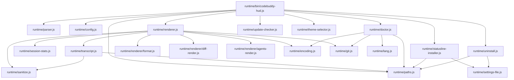
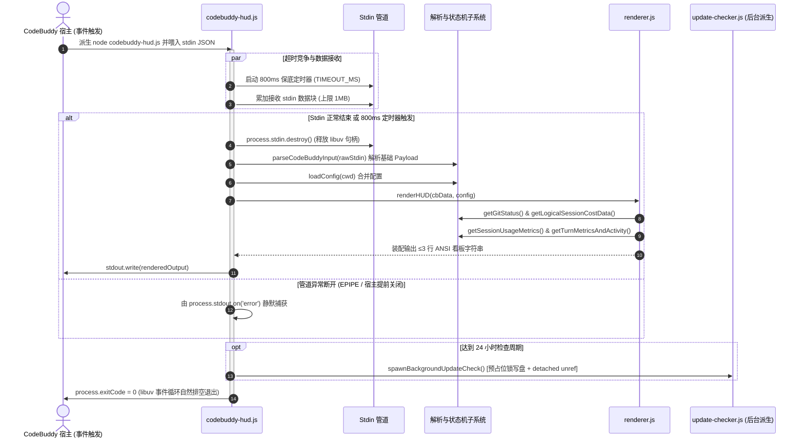

# CodeBuddy HUD 系统架构设计全景文档

> **目标版本：** `v0.2.0+`  
> **宿主兼容性：** CodeBuddy Code CLI；v2.146.0 存在下文说明的 Windows 引号与三行显示限制。
> **底层运行环境：** 纯 Node.js 标准库 (`>= 18.0.0`，绝对零外部 npm 依赖)

---

## 1. 架构总览与核心设计哲学

`codebuddy-hud` 是专为 **CodeBuddy Code** AI 结对编程终端助手量身打造的高性能状态栏看板插件。它能够在终端交互与代码流式生成过程中，以极低的系统开销实时渲染紧凑、高信息密度的 ANSI 彩色状态看板。

### 核心架构不变量（不可动摇的设计红线）：
1. **绝对零外部依赖 (Zero npm dependencies)**：
   - 纯基于 Node.js 原生标准库（`fs`, `path`, `os`, `crypto`, `child_process`, `readline`, `https` 等）构建，无需执行 `npm install`，分发体积保持在百 KB 级别。
2. **状态栏宿主契约 (Statusline Contract)**：
   - **执行预算**：整体单次执行预算 $\le 1500\text{ms}$，内部 Stdin 超时保底 $800\text{ms}$。定时器不能抢占同步文件调用或 JSON 解析。
   - **恒零退出码保证**：进程必须**恒定以 `process.exitCode = 0` 退出**。任何未捕获的运行时异常均重定向记录至 `~/.codebuddy/codebuddy-hud-error.log`（权限 `0o600`，上限 1MB 自动覆盖轮转），严禁抛出非零 Exit Code 破坏终端主会话。
   - **渲染输出行数约束**：终端渲染输出严格限制在 $\le 3$ 行，与宿主 stdout 前 3 行截断上限对齐，无数据行自动向上裁剪合并。
3. **真实遥测契约 (Truthful Telemetry)**：
   - Prompt Cache 命中率与累计 Credits 消费必须从真实的会话 `transcript.jsonl` 中逆向提取，缺失时优雅降级（如 `cache --`），**绝对严禁硬编码或伪造假数据**。

---

## 2. 两层物理分层架构 (Two-Layer Design)

`codebuddy-hud` 实现了插件元数据声明层与底层运行时执行层的物理隔离：

```
┌──────────────────────────────────────────────────────────────────────────┐
│  插件声明层 (PLUGIN LAYER)  CodeBuddy/Agent 识别入口，位于仓库根目录与 skills/ │
│   .codebuddy-plugin/plugin.json · skills/hud-config/SKILL.md            │
└────────────────────────────────────┬─────────────────────────────────────┘
                                     │  bootstrap.js 执行原子安装与覆盖
┌────────────────────────────────────▼─────────────────────────────────────┐
│  运行时执行层 (RUNTIME LAYER)  位于 ~/.codebuddy/codebuddy-hud-runtime/ 或本地检出│
│   runtime/bin/codebuddy-hud.js    ← 注册到 settings.json 的 statusLine 命令 │
│   runtime/bin/codebuddy-hud.cmd   ← Windows 平台便携式与绝对路径 Shim 启动脚本 │
│   parser.js · config.js · paths.js · encoding.js · git.js · sanitize.js │
│   doctor.js · update-checker.js · session-stats.js · uninstall.js       │
│   transcript.js (逆向滑窗扫描与 SHA-256 增量遥测状态机)                      │
│   renderer.js (3 行看板装配引擎) ──> renderer/ (format, diff, agents)    │
└──────────────────────────────────────────────────────────────────────────┘
```

- **插件声明层 (Plugin Layer)**：包含 `.codebuddy-plugin/` 与 `skills/`，声明插件指令集（`status`, `setup`, `uninstall`, `theme`, `doctor`）与 AI Agent 自助配置能力。
- **运行时执行层 (Runtime Layer)**：包含所有核心业务逻辑、渲染管道、状态机缓存与跨平台 Shim 适配脚本。

---

## 3. 模块依赖拓扑图 (Module Dependency Graph)



---

## 4. 单次交互执行流与生命周期时序 (Execution Flow)

宿主 v2.146.0 在会话、结果、配置等事件后约 300ms 去抖触发 HUD。空闲时不周期刷新；命令失败会清空 HUD，且不会自动定时重试。



---

## 5. 核心子系统与底层机制深度解析

### 5.1 逆向滑窗遥测扫描算法 (`transcript.js`)
- **痛点**：Prompt Cache 真实命中数、实际 Credits 扣费与工具调用序列仅存在于 `transcript.jsonl` 中，长会话下该文件可能达数十 MB。
- **算法细节**：
  1. **尾部逆向读取**：`getTurnMetricsAndActivity()` 用一次回扫聚合本轮 usage 和工具活动；默认滑窗 16KB，全扫描上限 256KB。会话 Credits 另用前向增量扫描。
  2. **跨块断行拼装 (Straddle Reconstruction)**：当滑窗边界切断了单行 JSONL 时，将未完成的前半段暂存并在读取前一块时完成拼装。
  3. **Turn 轮次边界截断**：从后向前逆向回扫 API usage 记录，直到遇到 `role: 'user'` 时停止，确保指标展示的是**当前这一轮交互的聚合命中率**。
  4. **字段优先级判定**：
     ```
     rawUsage.prompt_tokens 有效时：
       prompt_cache_hit_tokens -> prompt_tokens_details.cached_tokens -> cached_tokens -> 0
     否则，usage.inputTokens 有效时：
       sum(usage.inputTokensDetails[].cached_tokens)
     ```

### 5.2 会话基线捕获与 `/clear` 判定机制 (`session-stats.js`)
- **痛点**：用户在宿主输入 `/clear` 时，上下文窗口被清空，但宿主累积的总 token 或行数可能出现负增量或残留历史数据。
- **状态机**：
  1. 在 `~/.codebuddy/codebuddy-hud-session-state/<hash>.json` 记录会话基线。
  2. 触发判定规则：
     - 当前 `input_tokens` 降至不超过 2048，且此前当前输入至少 8192；或者累计 `total_input_tokens` 下降；
     - 同一文件路径被赋予了全新的 `session_id`；
     - 代码增删或耗时计数低于已存基线，此时将 cost 基线归零。
  3. 识别到重置后自动建立新基线，使看板显示的耗时与变更严格反映当前会话增量。

### 5.3 增量 SHA-256 Credits Checkpoint 机制 (`transcript.js`)
- **痛点**：每次事件刷新全量遍历长 JSONL 会重复解析已有消费记录。
- **增量 Checkpoint 状态机**：
  1. 基于 transcript 绝对路径 SHA-256 哈希隔离状态文件：`~/.codebuddy/codebuddy-hud-usage-state/<sha256>.json`。
  2. 状态文件为 version 5：`{ version, path, identity: { dev, ino, birthtimeMs }, headHash, offset, credits, creditCallCount, checkpointHash, sourceSize, sourceMtimeNs, sourceCtimeNs, sourceContentHash, updatedAt }`。
  3. 后续从 `offset` 增量解析，并保留少量身份与 checkpoint 校验读取。分块循环预算为 100ms；未完成时保存进度并返回 `complete: false`，不暴露累计 Credits。渲染层隐藏该值，也不回退到 payload Credits。未写完的 JSONL 尾行等待下一次续读。
  4. **覆写与截断容灾**：若检测到 `file.size < state.offset`，自动重置 `offset = 0` 并重建 Checkpoint。

### 5.4 后台更新检查防惊群风暴预占位锁 (`update-checker.js`)
- **连续派生**：事件密集时，网络请求尚未完成就可能再次启动 HUD。先写入 `lastCheck` 可减少重复派生，但它不是跨进程互斥锁。
- **时间戳预占位实现**：
  ```javascript
  // 派生后台进程前立即落盘时间戳，阻断后续并发实例
  writeUpdateStatus({
    ...(currentStatus || {}),
    lastCheck: Date.now(), // 关键：先行预占位锁
  });
  const child = spawn(process.execPath, [scriptPath, '--run-check'], {
    detached: true,
    stdio: 'ignore',
    windowsHide: true,
  });
  child.unref();
  ```
  网络失败保留上次有效更新结果并刷新 `lastCheck`；请求总计时器为 8s，独立后台 CLI 另有 15s 退出兜底。

### 5.5 多层级配置合并与主题调色板引擎 (`config.js`)
- **配置覆盖优先级**：
  ```
  内置默认配置 (DEFAULT_CONFIG)
    → 随包配置 (runtime/codebuddy-hud.config.json)
      → 用户全局配置 (~/.codebuddy/codebuddy-hud.config.json)
        → 项目局部配置 (./codebuddy-hud.config.json)
          → 主题解析 (resolveTheme)
  ```
- `--theme <name>` 将主题保存到用户配置，不是运行时覆盖层。
- **安全性防护**：`deepMerge()` 跳过 `__proto__`，递归深度上限 64。配置文件每次直接读取；settings effort 仅保留进程内缓存，transcript effort 信号则按 transcript 哈希持久化到会话状态目录（`effort-<sha256>.json`），支持长任务的尾部扫描裁决、缓存继承与冷启动头扫兜底。

### 5.6 3 行自适应布局与自裁剪规则 (`renderer.js`)
- **Line 1 (标识与状态)**：模型名称 · 推理深度 (effort) · Git 分支与 Dirty 状态 (`*`) · 工作区目录 · 权限模式 · 版本提示。
- **Line 2 (Tokens 与上下文)**：总 Tokens (输入/输出拆解) · 进度条 (`[███░░░░░░░]`) · 用量百分比 · 本轮 Cache 命中率徽标。
- **Line 3 (变更、消费、耗时与工具活动)**：`Δ +增加 -删除` · 实际 Credits · 总耗时 · 当前工具活动与本轮完成频次聚合（`◐ Edit: parser.js`、`✓ Edit ×3`）。（无数据自动隐藏整行）。

宿主 v2.146.0 仅保留 stdout 前 3 行。HUD 的 3 行输出契约与该截断上限严格对齐；工具活动并入 Line 3，确保所有关键信息在截断限制下完整可见。

---

## 6. 终端安全威胁模型与过滤机制

所有外部文本输出前必须调用 `runtime/sanitize.js` 的 `sanitizeTerminalText()`：

| 攻击威胁 | 载荷示例 | 防御过滤实现 (`runtime/sanitize.js`) |
| :--- | :--- | :--- |
| **ANSI CSI 注入** | `\x1b[2J\x1b[H` (清屏覆盖攻击) | 正则剔除 `/\x1b\[[0-?]*[ -/]*[@-~]/g` |
| **OSC 剪贴板/标题劫持** | `\x1b]52;c;...\x07` (剪贴板注入) | 正则剔除 `/\x1b\][^\x07]*?(?:\x07|\x1b\\|$)/g` |
| **Unicode Bidi 伪装** | `\u202E` (从右向左覆盖伪装) | 剔除 `U+202A` ~ `U+202E` 与 `U+2066` ~ `U+2069` 控制符 |
| **C0/C1 控制符污染** | `\x00-\x08`, `\x0B-\x1F`, `\x7F` | 剔除 NUL 字节与非常规控制符 |
| **超长字符串溢出** | 50,000 字符的畸形 Git 分支名 | 强制根据视口安全边界截断（如 64/128 字符） |

---

## 7. 故障降级与容灾矩阵 (Failure Degradation Matrix)

| 故障场景 | 诱发原因 | 系统降级表现 | Exit Code |
| :--- | :--- | :--- | :---: |
| **空 Stdin** | Windows 宿主启动时序抖动 | 优雅回退至最小 Payload 渲染，输出基础行 | `0` |
| **Stdin 管道悬挂** | 宿主未按时发送 EOF 结束管道 | $800\text{ms}$ 定时器触发，强行切断 Stdin 并按已收数据渲染 | `0` |
| **EPIPE 错误** | 宿主提前关闭 Stdout 接收管道 | `process.stdout.on('error')` 静默捕获，安全退出 | `0` |
| **Transcript 缺失** | 首轮会话 / 远程无盘环境 | 隐藏工具活动，Token 回退使用 payload；Credits 仅使用 payload 明示的实际值 | `0` |
| **状态文件截断损坏** | 异常断电 / 进程被强杀 | 自动丢弃损坏 JSON，重置偏移量为 0 全量重建 | `0` |
| **只读文件系统** | 权限受限的容器环境 | 状态写入静默失败；未完成的 Credits 隐藏，后续调用可能从头重建 | `0` |
| **Git 超时** | 庞大 Mono-repo / 网络挂载盘 | 若能直接读出分支则保留分支并返回 `dirty: null`，否则隐藏 | `0` |
| **检查更新网络失败** | 离线环境 / GitHub API 限制 | 保留已有状态并刷新 `lastCheck` 时间戳，静默退出 | `0` |

---

## 8. 跨平台与零依赖设计保障

1. **Windows `.cmd` Shim 绝对路径烘焙**：
   - `statusline-installer.js` 在 `--setup` 时将当前环境的 `process.execPath` 绝对路径固化写入 `.cmd`。
   - 自动将路径中的 `%` 批量转义为 `%%`，免疫 `cmd.exe` 变量误展开。
   - shim 为 UTF-8，必要时先 `chcp 65001`；实测 cmd.exe 不支持 UTF-16LE 批处理文件。
   - v2.146.0 containment 会二次转义字面引号。安全 ASCII shim 路径省略引号；需要引号的路径保留引号，仍受宿主兼容限制。
2. **终端编码自动探测与缓存**：
   - Windows 下通过 `chcp.com` 探测代码页并缓存于 `codebuddy-hud-cache-state.json`（`65001`）。
   - 在不支持 UTF-8 的终端自动无缝回退至纯 ASCII 字符集（`#`, `-`, `|`, `[A]`, `[Q]`, `[D]`）。
3. **事件循环自然排空退出 (Natural Drain)**：
   - 渲染完成后主动释放 Stdin 句柄与定时器，依靠 Node.js 事件循环自然排空退出，杜绝 `process.exit()` 引起的异步 Stdout 缓冲区截断。
4. **配置写入**：
   - JSONC 解析保留字符串。原子替换跟随有效符号链接，保留现有 POSIX 权限和所有者；新配置及首次备份默认 `0600`。多硬链接目标会被拒绝，避免悄悄断链。
   - 卸载只恢复 `statusLine`，保留其他 settings 及用户主题；写入失败保留备份。
5. **验证隔离**：
   - 安装卸载测试同时隔离 runtime、settings 和用户目录；仅设置 `CODEBUDDY_HOME` 不能保护真实 shim。
